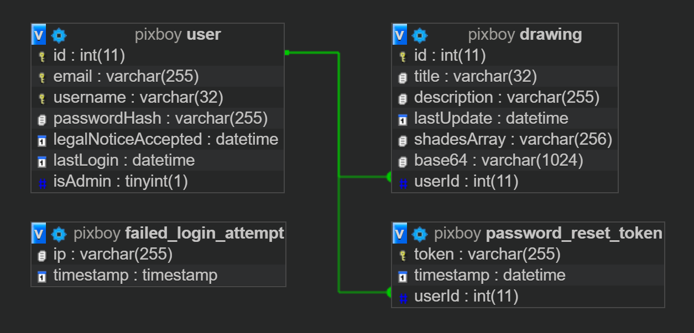
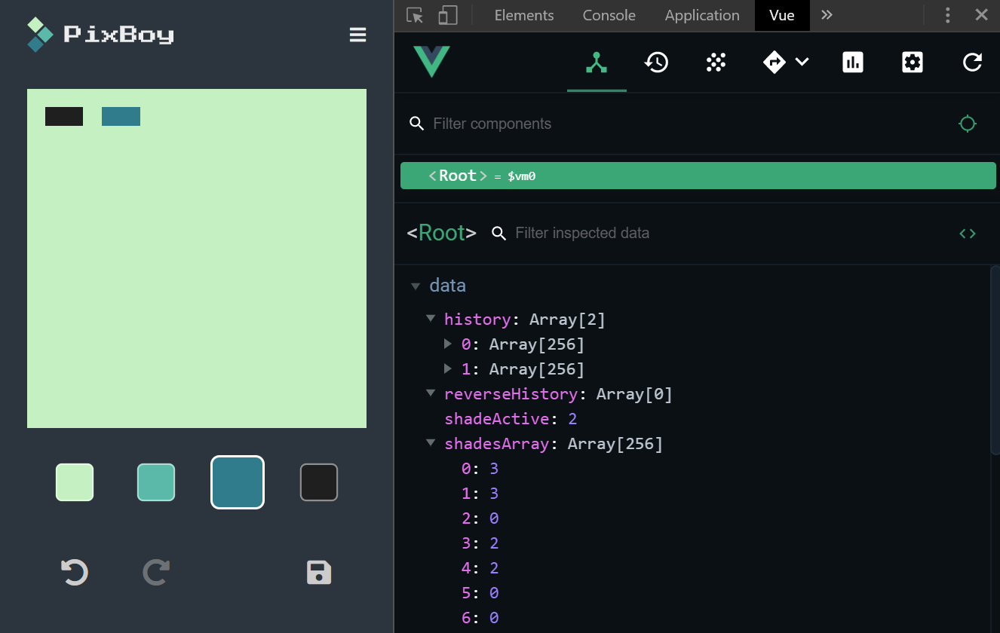

# PixBoy

A platform and editor for Game Boy pixel art.

## Requirements

- PHP 7.3 or higher
- Apache 2.4.41  or higher
- MariaDB 10.4.8 or higher

## Setup

- Download or clone this repository
- Open a mysql shell in your terminal: `mysql -p -u your_user_here`
- Create a database for PixBoy: `CREATE DATABASE pixboy; USE pixboy;`
- Import `database/pixboy.sql` into your database: `SOURCE database/pixboy.sql;`
- Add your database credentials to `htdocs/global/config.php`
- Upload the contents of `htdocs` to your server's document root

To activate the admin account, follow these additional steps:

- Open an interactive php shell in your terminal: `php -a`
- Generate a hash for the admin password of your choice: `echo password_hash('your_password_here', PASSWORD_DEFAULT);`
- Run the following SQL against your database with the hash you just generated:
  ```sql
  UPDATE user
  SET passwordHash='your_hash_here'
  WHERE username='admin';
  ```
- You can now log in as admin with your password

## Project structure

The following list roughly shows and explains the file and folder structure of PixBoy:

```text
PixBoy # project folder
|-- database/ # database sql dump
|-- docs/ # documentation 
|-- htdocs/ # document root, to be pushed to production server
|   |-- global/ # globally executed php
|   |-- layouts/ # reusable page layouts
|   |-- public/ # publicly accessible file structure
|   |   |-- _api/ # non-page endpoints
|   |   |-- _assets/ # global assets
|   |   |-- page-1/
|   |   |-- page-2/
|   |   |-- page-3/ # one folder per page
|   |   |   |-- index.php # logic and markup of page
|   |   |   |-- script.css # page specific js
|   |   |   |-- style.css # page specific css
|   |   |   `-- image.png # ...and other page specific assets
|   |   |-- favicon.png
|   |   `-- index.php # redirect to home page
|   |-- vendor/ # third-party php
|   |-- .htaccess # redirect all requests to public folder
|   |-- config.php # credentials and other config values
|   `-- global.php # loader for global php, required on every page
|-- .gitignore
|-- README.md
|-- README-editor.png
|-- README-homepage.png
|-- package-lock.json
`-- package.json
```

## Requests

All requests are handled by the `.htaccess` file and redirected to the public folder. A request like `/_assets/style/reset.css` actually returns the file `/public/_assets/style/reset.css`.

When requesting a page, it will first require `global.php`, then execute its own code and finally merge itself with one of the layouts to generate the final HTML response.

## Page structure

Every page's `index.php` is divided into the following three sections:

**Code section**: Requires global php and contains the page's logic (validation, database interactions etc.). Values to be used by the markup section are saved into variables.
```php
<?php
require_once 'global.php'; 
// ...
?>
```

**Markup section**: The template for the page's unique markup. The output is saved into the output buffer by `ob_start()`.
```php
<?php
// markup
////////////////////////////////////////////////////////////////////////////////
ob_start();
?>
<main class="main">
  <div class="main_inner">
    <h1>About</h1>
    <p>Lorem ipsum dolor sit amet, consectetur adipiscing elit.</p>
    <!-- ... -->
  </div>
</main>
```

**Settings section**: The page's parameters are to be saved in an array called `$page`, including the buffered output from the markup section. These values will be used in the required layout to create the final HTML response.
```php
<?php
// settings
////////////////////////////////////////////////////////////////////////////////
$page = [
  'title' => 'PixBoy | About',
  'description' => 'About PixBoy and its creator, Simon Jäger',
  'content' => ob_get_clean(),
];
require_once ROOT . '/layouts/default.php';
?>
```

---

The default layout is currently the only layout available. It supports the following parameters:

Parameter | Description
--- | ---
title | Injected into `<title>`
description | Injected into `<meta name="description>"`
content | Injected between header and footer
css | Array of additional css files to be included
js | Array of additional js files to be included

## Database

Persistent data is stored in a MySQL database which implements the following scheme:



Table | Description
--- | ---
user | Stores user accounts and privileges (isAdmin)
drawing | Stores drawings and links them to the corresponding user
failed_login_attempt | Stores failed login attempts by IP and timestamp
password_reset_token | Stores one-time tokens for password resets

The *drawing* table also store the image data directly as base64.

## Session

An ordinary PHP session is used to store state between different requests. It consists of the following fields:

Field | Description
--- | ---
isUser | Flag, marks client as an authenticated user
isAdmin | Flag, marks client as an authenticated admin
username | Username of user
userId | Id of user
ip | IP used at session creation
timestamp | timestamp of last session refresh

The IP and timestamp are used to limit each session to a single IP and a maximum lifetime.

## Editor

The editor allows the creation and modification of sprites. Each sprite is 16x16 pixel in size, for a total of 256 pixels. Each pixel is colored in one of the four available shades (0, 1, 2, 3).

The sprite's pixels are saved in a `shadesArray` of numbers from 0 - 3, representing the four shades. Interacting with the drawing area modifies this array, which in turn updates the drawing area.

On every uninterupted stroke, the old array is pushed unto a history stack. The back and forward buttons allow navigating through this history to restore older states.


*Screenshot of editor and underlying data*
